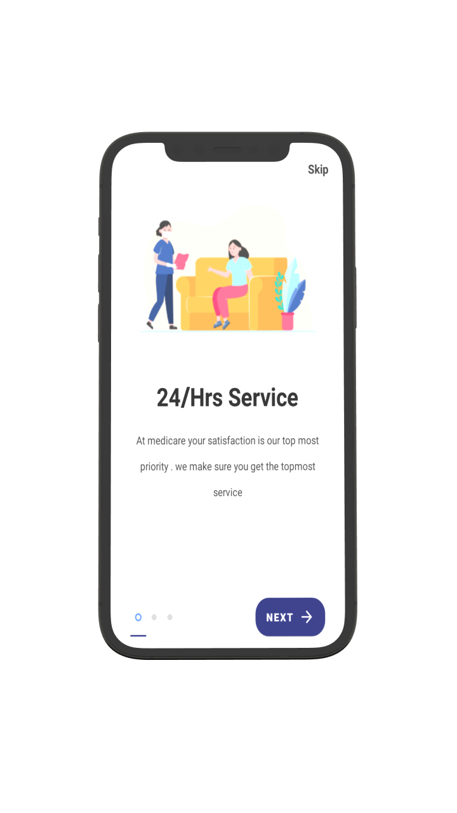
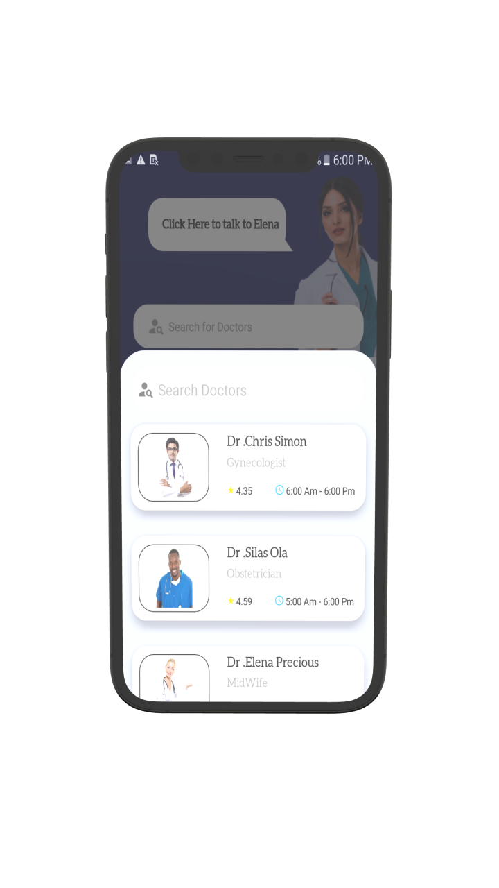

# MediCare
A Medical App that helps patient find and connect doctor, give daily tips and allow them chat with medicare assitance.

## Features
* Kotlin Coroutines with Flow (State Flow)
* Clean Architecture with MVVM
* Jetpack Navigation Component
* Dagger Hilt

## Libraries
*   [Retrofit 2](https://square.github.io/retrofit/) : A type-safe HTTP client for Android and Java
*   [OkHttp Logging Interceptor](https://github.com/square/okhttp/tree/master/okhttp-logging-interceptor) : An OkHttp interceptor which logs HTTP request and response data.
*   [Gson](https://github.com/google/gson) : An Object-to-JSON serialization/deserialization library
*   [Kotlin Coroutines](https://developer.android.com/kotlin/coroutines) : A coroutine is a concurrency design pattern that you can use on Android to simplify code that executes asynchronously.
*   [ViewModel](https://developer.android.com/topic/libraries/architecture/viewmodel) : The Navigation component is a library that can manage complex navigation, transition animation, deep linking, and compile-time checked argument passing between the screens in your app.
*   [Jetpack Navigation component](https://developer.android.com/guide/navigation/navigation-dynamic)
*   [Glide](https://github.com/bumptech/glide) : Glide is a fast and efficient open source media management and image loading framework for Android
*   [ShimmerLayout](https://github.com/facebook/shimmer-android) : Shimmer is an Android library that provides an easy way to add a shimmer effect to any view in your Android app.
*   [Sentry Crashlytics](https://sentry.io/from/crashlytics/)
*   [Paging 3](https://developer.android.com/topic/libraries/architecture/paging/v3-overview) : The Paging library helps you load and display pages of data from a larger dataset from local storage or over network
*   [Dagger Hilt](https://dagger.dev/hilt) : Hilt provides a standard way to incorporate Dagger dependency injection into an Android application.
*   [Material Design Components](https://material.io)
*   [Image Cropper](https://github.com/ArthurHub/Android-Image-Cropper)
*   [Timber](https://github.com/JakeWharton/timber) : This is a logger with a small, extensible API which provides utility on top of Android's normal Log class.
*   [JetPack Datastore Preference](https://developer.android.com/topic/libraries/architecture/datastore) : Jetpack DataStore is a data storage solution that allows you to store key-value pairs or typed objects with protocol buffers.
*   [Room](https://developer.android.com/training/data-storage/room) : The Room persistence library provides an abstraction layer over SQLite to allow fluent database access while harnessing the full power of SQLite.

<h2 align="left">Screenshots</h2>
<h4 align="center">

 

## Author
Elezua Victor
